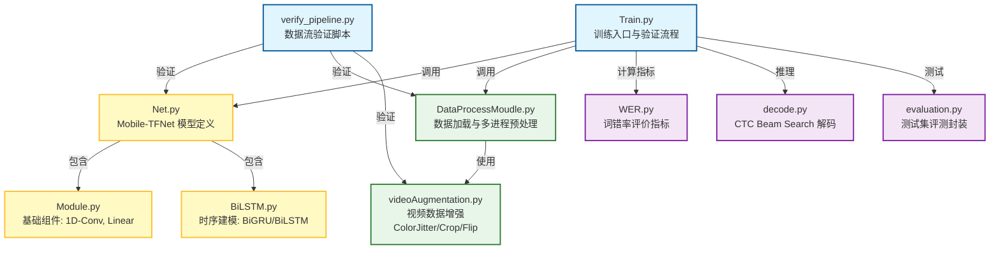

# 面向移动端的复杂环境中文手语识别系统 (Mobile-TFNet) - 技术路线与系统架构

本文档详细阐述了 **Mobile-TFNet** 的系统架构设计、核心技术改进点以及实施技术路线。本项目旨在将传统的重型手语识别模型（TFNet）进行轻量化重构，使其能够在移动端设备上高效运行，同时保持在复杂环境下的识别准确率。

---

## 1. 系统架构设计 (System Architecture)

系统整体采用 **End-to-End** 的序列学习架构，主要包含数据输入层、视觉特征提取层（Visual Module）、时序建模层（Temporal Module）和解码输出层。

### 1.1 数据输入与增强层 (Input & Augmentation)
- **输入数据**：连续的 RGB 视频帧序列，形状为 $(B, T, C, H, W)$，其中 $B$ 为 Batch Size，$T$ 为时间步长。
- **动态预处理**：
  - **空间增强**：`RandomCrop` (随机裁剪)、`RandomHorizontalFlip` (随机水平翻转)。
  - **环境模拟**：引入 **`ColorJitter`** (色相/饱和度/亮度抖动)，模拟不同光照和背景环境，提升模型鲁棒性。
  - **时序增强**：`TemporalRescale` (时序重缩放)，模拟不同语速。

### 1.2 轻量化视觉模块 (Visual Module: MobileNetV2)
- **骨干网络**：使用 **MobileNetV2** (ImageNet 预训练) 替换原有的 ResNet34。
  - **深度可分离卷积 (Depthwise Separable Convolution)**：大幅降低参数量和计算量。
  - **倒残差结构 (Inverted Residuals)**：高效提取帧级空间特征。
- **特征降维**：
  - 原始 MobileNetV2 输出特征维度为 1280。
  - 通过自定义 **Linear Projection Layer** 将特征维度压缩至 **512** (Feature Dim)，以适配后续时序网络，进一步减少内存占用。

### 1.3 变长序列推理优化 (Inference Optimization)
- **痛点解决**：传统 Batch 训练中包含大量 Padding (零填充) 帧，导致 CNN 进行无效计算。
- **优化策略**：
  1. **Flatten & Filter**：将 Input Tensor $(B, T, C, H, W)$ 展平，根据 `videoLength` 剔除所有 Padding 帧，仅保留有效帧。
  2. **Effective Computation**：仅对有效帧执行 MobileNetV2 前向传播。
  3. **Sequence Reconstruction**：将计算后的特征向量重新填充并 Stack 回 $(B, T, F)$ 格式。
- **效果**：FLOPs (浮点运算量) 随实际视频长度线性增长，而非受限于 Batch 中最长视频的长度，推理速度大幅提升。

### 1.4 时序建模与解码 (Temporal Module & Decoding)
- **时序网络**：使用 **BiGRU (Bidirectional Gated Recurrent Unit)** 替换 BiLSTM。
  - GRU 门控机制更简单（仅 Update 和 Reset 门），参数量减少约 25%，且收敛速度更快。
- **分类与损失**：
  - **Classifier**：全连接层将隐藏层特征映射到词表大小。
  - **Loss Function**：采用 **CTC Loss (Connectionist Temporal Classification)**，去除原项目中复杂的知识蒸馏 (KD Loss) 和多分支辅助 Loss，聚焦于端到端序列对齐学习。

---

## 2. 关键技术改进 (Key Technical Improvements)

| 模块 | 原 TFNet/MSTNet 方案 | Mobile-TFNet (本项目) | 改进优势 |
| :--- | :--- | :--- | :--- |
| **视觉骨干** | ResNet34 / 3D-CNN | **MobileNetV2** | 参数量降低 ~80%，适合移动端部署 |
| **时序单元** | BiLSTM (双向 LSTM) | **BiGRU (双向 GRU)** | 结构更精简，推理延迟更低 |
| **批次处理** | 对全 Padding 序列计算 | **仅计算有效帧 (Masking)** | 消除无效计算，大幅降低 FLOPs |
| **损失函数** | CTC + KD Loss + MSE | **Pure CTC Loss** | 训练目标更纯粹，显存占用更低 |
| **数据增强** | 基础裁剪/翻转 | **增加 ColorJitter 环境模拟** | 增强对光照变化的泛化能力 |

---

## 3. 技术路线 (Technical Roadmap)

### 阶段一：环境搭建与基准复现 (Infrastructure & Baseline) - [已完成]
1.  **环境配置**：构建 PyTorch 深度学习环境，解决 `ctcdecode` 等依赖库问题。
2.  **数据流打通**：完成 CE-CSL/CSL-Daily 数据集的清洗、词表生成 (`DataProcessMoudle.py`)。
3.  **基准测试**：跑通原版代码，验证数据加载器 (DataLoader) 和评估指标 (WER) 的正确性。

### 阶段二：核心架构重构 (Core Refactoring) - [已完成]
1.  **骨干替换**：实现了 `Net.py` 中的 `LightTFNet` 分支，集成 MobileNetV2。
2.  **前向重写**：重构 `forward` 函数，实现变长序列的有效帧提取与重组逻辑。
3.  **时序升级**：将 LSTM 模块改造为 GRU，并完成输入输出维度的对齐。
4.  **单元验证**：通过 `verify_pipeline.py` 验证了新架构下的张量流 (Tensor Flow) 形状匹配。

### 阶段三：鲁棒性与训练策略优化 (Robustness & Strategy) - [已完成]
1.  **增强模块开发**：在 `videoAugmentation.py` 中实现支持视频序列的 `ColorJitter`。
2.  **训练流程集成**：修改 `Train.py`，移除冗余 Loss，集成混合精度训练 (AMP) 以支持更大 Batch Size。

### 阶段四：云端训练与实验验证 (Training & Evaluation) - [进行中]
1.  **模型训练**：
    - 在 GPU 服务器上开展全量数据训练。
    - 监控 Training Loss 与 Validation WER 曲线。
2.  **消融实验 (Ablation Study)**：
    - 对比 ResNet34 vs MobileNetV2 的精度与速度差异。
    - 验证 ColorJitter 数据增强对复杂背景样本的增益。
3.  **性能评估**：
    - 计算最终测试集 WER (Word Error Rate)。
    - 统计模型参数量 (Params) 和计算量 (FLOPs)。

### 阶段五：移动端部署准备 (Deployment Prep) - [展望]
1.  **模型导出**：将 PyTorch 模型导出为 **ONNX** 格式。
2.  **端侧推理**：使用 NCNN 或 TNN 推理框架在 Android/iOS 设备上进行部署测试。
3.  **实时性优化**：进一步进行模型量化 (Quantization, FP16/INT8)。

---

## 4. 代码结构与模块关系 (Code Structure & Dependencies)

以下Mermaid图展示了项目中各个Python脚本及其模块之间的依赖调用关系，体现了核心训练、模型定义与数据处理的分离设计。

